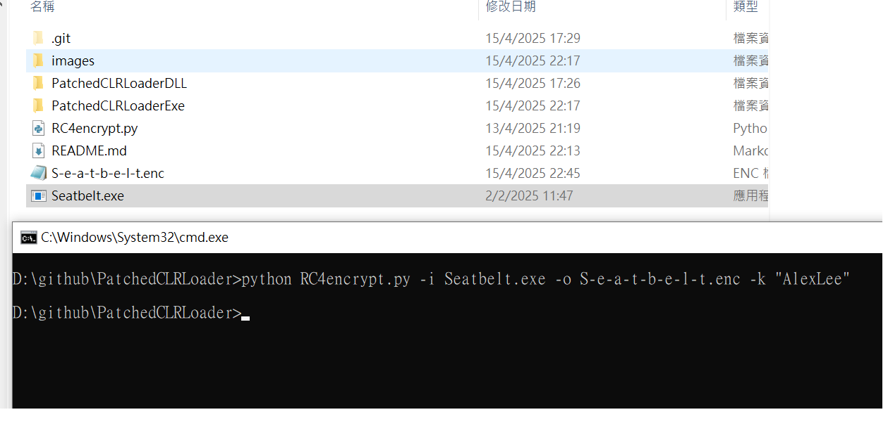

# PatchedCLRLoader
PatchedCLRLoader is a fork of PatchlessCLRLoader to load .NET assembly and direct the output to mailslot.This is a practise for me to write malware so I use patching instead of hwbp to bypass AMSI and ETW. :
<ul>
  <li>RC4 encryption payload</li>
  <li>Patching CLR and ETW bypass via direct Syscalls</li>
</ul>


Since patching AmsiScanBuffer in amsi.dll and Eventwrite in ntdll.dll does not work in new windows defender version (e.g. win11),I have also tried to use hwbp in crowdstrike but do not know why it does not execute anything. Therefore, I tried to patch the AmsiScanBuffer in clr.dll and NtTraceEvent instead.

<b>Why patching clr work？<b>
Reference: <https://practicalsecurityanalytics.com/new-amsi-bypss-technique-modifying-clr-dll-in-memory/>


when you are loading assembly ,AmsiScanBuffer will be called in amsi.dll , the AmsiScanBuffer function will then call AmsiScan in clr.dll which will  


the AV will only identified the contents as malicious when the global_pAmsiContext is not equal to 0 in AmsiScan function in clr.dll. So we may find the address of the AmsiScanBuffer in GetProcAddress, and simply patch it to zero or not exist function buffer.Then, the Amsi can be easily bypassed. 

# Usage

<b>RC4 Encrypt Payload</b>

```
python RC4encrypt.py -i <c# assembly> -o <output> -k <Encryption Key>
```


# AV / EDR Testing Result

| AV/EDR Product | Execute |
| ------ | ------ |
| Palo Alto Cortex XDR | :white_check_mark: |
| Sophos  | :white_check_mark: |
| MDE | :white_check_mark: |
| CrowdStrike | :white_check_mark: |

# Credits
InlineExecute-Assembly - <https://github.com/anthemtotheego/InlineExecute-Assembly> </br>
PatchlessCLRLoader - <https://github.com/VoldeSec/PatchlessCLRLoader></br>
<https://github.com/S3cur3Th1sSh1t/Amsi-Bypass-Powershell></br>
<https://github.com/Mr-Un1k0d3r/AMSI-ETW-Patch>
